<!DOCTYPE html>
<html>
<head>
<title>Belajar Style Sheet Pada CSS</title>

</head>
<body>

# 1945
## **"As We May Think" (Seperti yang Mungkin Kita Pikirkan)"**

###### **Vannevar Bush (1890-1974)**
_________

Pada tahun 1945, Vannevar Bush - Menulis esai yang berjudul “As We May Think”, esai ini pertama kali diterbitkan dalam edisi Juli 1945 dari <em>Atlantik Bulanan.</em> Bush menulis bahwa hanya dengan menggunakan teknologi, orang dapat mengikuti sejumlah besar pengetahuan yang sedang diciptakan dunia. “Penjumlahan dari pengalaman manusia sedang diperluas pada tingkat yang luar biasa,” katanya.

Dengan akhir Perang Dunia II yang sudah di depan mata, Bush secara elegan memprediksi banyak teknologi saat ini, termasuk pengenalan suara, internet, <em> World Wide Web </em>, <em> ensiklopedia online </em>, <em>hypertext</em>, asisten digital pribadi, layar sentuh, dan desain antarmuka pengguna interaktif.

Tantangan utama yang ia fokuskan adalah bagaimana informasi harus diatur. Bush menemukan bahwa sistem numerik dan alfabet yang dominan tidak efektif. Sebaliknya, dia percaya bahwa pikiran manusia menyimpan dan memahami informasi melalui asosiasi, ketika pikiran kita berpindah dari satu ide ke ide  berikutnya, menciptakan konteks dan makna asli. 

<em> Memex </em> adalah kepandekan dari "Pemanjang Memori" yang mana Alternatif teoritisnya untuk sebuah organisasi taksonomi. <em>Memex</em> akan membuat jejak sendiri pemikiran dan sumber informasi terkait. Perangkat dalam bentuk artikel, ensiklopedia yang mudah diakses yang terdapat pada mikrofilm (disimpan pada gulungan di dalam meja), stylus untuk menambahkan catatan sendiri langsung ke layar, dan cara untuk menghubungkan jejak orang. Dengan pengecualian mikrofilm, Bush cukup berhasil.

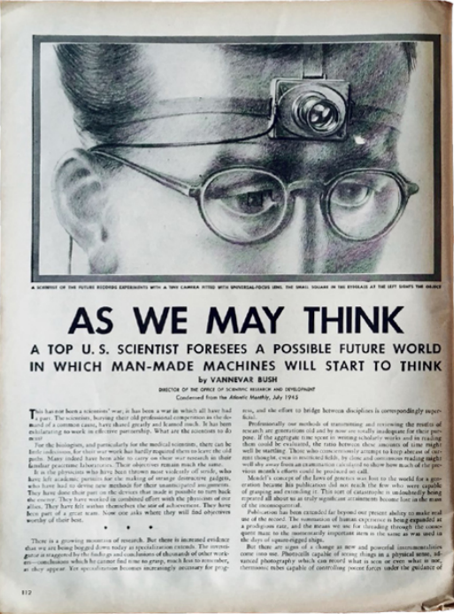

 
 
 
 
 
 
 
 
 
 
 
 
 
 
 
 
 
 
 
 

# 1945

## **EDVAC Draf Laporan Pertama**

###### **John Mauchly** (1907–1980), **J. Presper Eckert** (1919–1995), **John von Neumann** (1903–1957), **Herman Goldstine** (1913–2004)
___

Sebelum ENIAC beroperasi, J. Presper Eckert dan John Mauchly telah merancang  sebuah komputer yang bahkan lebih kuat, EDVAC (Electronic Discrete Variable Automatic Computer).

EDVAC menyerupai apa yang kita pikirkan sebagai komputer modern. Itu memiliki bank memori yang menyimpan program dan data komputer, dan unit pemrosesan pusat (CPU) mengambil instruksi dari memori dan mengeksekusinya. Program yang disimpan dalam memori utama diarahkan ketika data harus disalin dari memori ke dalam CPU, ketika fungsi matematika diterapkan, dan ketika hasilnya harus ditulis kembali ke memori utama.

<em> Von Neumann </em> dan rekan fisikawan merancang lensa peledak yang digunakan untuk meledakkan bom ledakan yang digunakan di Trinity, New Mexico, dan Nagasaki dan Hiroshima, Jepang. Saat mengerjakan perhitungan yang sangat rumit itu,  Goldstine memperkenalkan Von Neumann kepada Eckert dan Mauchly; segera setelah itu, Von Neumann bergabung dengan kelompok belajar yang merancang EDVAC.

Von Neumann menulis catatannya saat bepergian ke Los Alamos, New Mexico, dan mengirimkannya kembali ke Goldstine, yang mengetiknya, berjudul dokumen Draf Pertama Laporan tentang EDVAC,masukkan nama von Neumann di sampulnya (walaupun sebagian besar karya Eckert dan Mauchly), dan mendistribusikan 24 cetak. 

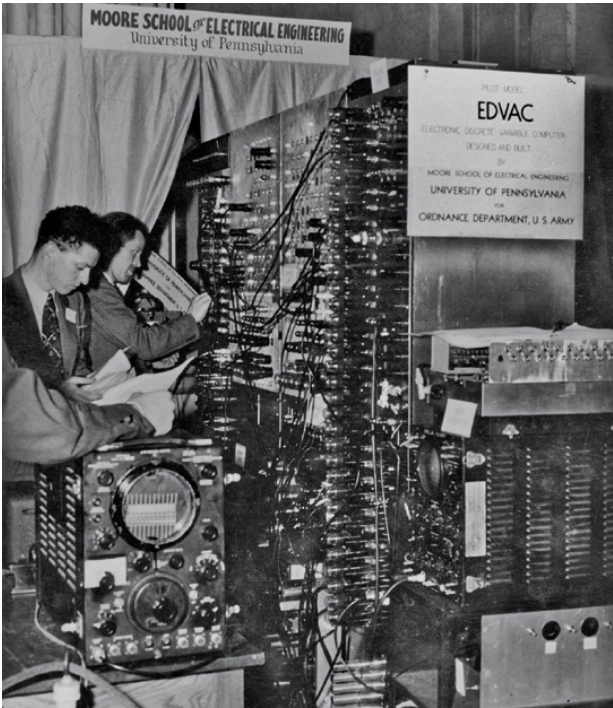

 
 
 
 
 
 
 
 
 
 
 
 
 
 
 
 
 
 
 
 

# 1946

## **Trackball**

###### **Ralph Benyamin**(b. 1922), **Kenyon Taylor**(1908–1986), **Tom Cranston** (c. 1920–2008), **Fred Longstaff**(tanggal tidak tersedia)
___

Trackball adalah salah satu perangkat input komputer pertama yang memungkinkan gerakan kursor bentuk bebas oleh pengguna, secara bersamaan di kedua x - dan y- pada layar komputer. Tetapi ada waktu yang lama antara penemuannya dan penggunaannya secara luas.

Seorang insinyur Inggris bernama Ralph Benjamin merancang trackball prototipe pertama saat mengerjakan proyek radar untuk Dinas Ilmiah Angkatan Laut Kerajaan  pada tahun 1946. Proyek radar itu disebut Sistem Tampilan Komprehensif dan memungkinkan kapal untuk memantau pesawat yang terbang rendah pada koordinat X dan Y  menggunakan joystick sebagai perangkat input.

Pada tahun 1952, insinyur Kanada Tom Cranston, Fred Longstaff, dan Kenyon Taylor membangun konsep Benjamin dan merancang trackball untuk sistem Digital Automated Tracking and Resolve (DATAR) Angkatan Laut Kanada, sistem informasi medan perang yang terkomputerisasi. Desainnya berdasarkan bola bowling lima poin Kanada, memungkinkan operator untuk mengontrol dan melacak lokasi input pengguna di layar.

Roller ball Benjamin akhirnya memiliki pengaruh besar pada perkembangan mouse dan trackball modern. Bola rol berbeda dari mouse dalam hal itu adalah objek stasioner yang dikendalikan oleh tangan dan jari pengguna yang bergerak di atasnya, daripada memposisikan ulang seluruh perangkat ke lokasi yang berbeda di ruang fisik.

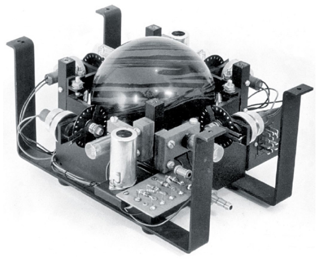

 
 
 
 
 
 
 
 
 
 
 
 
 
 
 
 
 
 
 
 

# 1946

## **Williams Tube (Tabung Williams)**

###### **Frederic Calland Williams** (1911–1977), **Tom Kilburn** (1921–2001)
___

Tabung Williams (kadang-kadang dikenal sebagai Tabung William–Kilburn), adalah sistem memori elektronik pertama, menyediakan akses acak, artinya setiap lokasi memori dapat diakses dalam urutan apa pun.

Tabung itu adalah tabung sinar katoda, seperti yang mungkin 
digunakan dalam tampilan radar Perang Dunia II, tetapi dimodifikasi sehingga titik-titik yang ditampilkan di layar dapat dibaca oleh komputer. Tabung Williams awal menyimpan data satu digit biner — 0 atau 1 — pada suatu waktu dalam susunan persegi panjang, biasanya 64 x 32. 

Komputer IBM 701 menggunakan 72 tabung Williams untuk menyimpan 2.048 kata 36-bit; Namun, tabung Williams tidak terlalu andal, dan 701 dilaporkan hanya akan berjalan selama 15 menit sebelum mogok karena kesalahan memori. Memang, tabung itu sangat tidak dapat diandalkan sehingga Mesin Eksperimental Skala Kecil Manchester (SSEM), dijuluki Bayi, dibangun khusus untuk tujuan pengujian tabung Williams.

Komputer Whirlwind MIT, pertama kali beroperasi pada tahun 1949, pada awalnya dirancang untuk menggunakan tabung Williams yang dimodifikasi yang menghilangkan kebutuhan untuk menyegarkan dengan menggunakan senjata elektron kedua yang disebut apistol banjir; Tetapi tabung Williams yang dimodifikasi berharga $ 1.000 masing-masing dan memiliki masa pakai sekitar satu bulan. Disibukkan dengan masalah yang disebabkan oleh tabung penyimpanan ini, direktur Whirlwind, Jay Forreste (1918–2016), menemukan memori inti sebagai penggantinya.

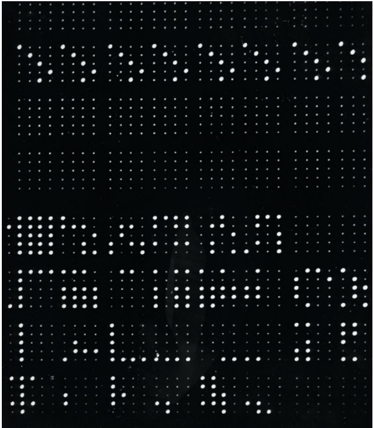

 
 
 
 
 
 
 
 
 
 
 
 
 
 
 
 
 
 
 
 

# 1947

## **Actual Bug Found (Bug yang sebenarnya di temukan)**

###### **Howard Aiken**(1900–1973), **William “Bill” Burke**(tanggal tidak tersedia), **Grace Murray Hopper**(1906–1992)
___

Profesor Harvard Howard Aiken menyelesaikan komputer Mark II pada tahun 1947 untuk Naval Proving Ground di Dahlgren Virginia. Saat ini kita masih menggunakan frase "arsitektur Harvard" untuk menggambarkan komputer yang secara terpisah menyimpan program mereka dari data mereka, tidak seperti mesin "Von Neumann" yang menyimpan kode dan data dalam memori yang sama.

Pada hari itu pukul 10:00 pagi komputer gagal dalam tes, menghasilkan angka 2.130476415 bukannya 2.130676415. Operator menjalankan tes lagi pada pukul 11:00, dan kemudian lagi pada pukul 15:25 Akhirnya, pada pukul 15:45, operator komputer, termasuk William “Bill” Burke, melacak masalah tersebut ke ngengat yang bersarang di dalam Relay # 70, Panel F. Operator dengan hati-hati menghapus bug dan menempelkannya ke buku catatan laboratorium, dengan notasi "Kasus bug pertama yang sebenarnya ditemukan."

Grace Hopper tidak benar-benar menemukan bug itu, tetapi dia menceritakan kisah itu dengan sangat baik, dan berkali-kali, 
sehingga banyak sejarah sekarang secara keliru memuji dia dengan penemuan itu. Adapun kata bug, itu telah digunakan untuk menggambarkan kesalahan pada mesin sejak tahun 1875;
Menurut kamus bahasa Inggris oxford, pada tahun 1889, Thomas Edison mengatakan kepada seorang jurnalis bahwa dia telah begadang dua malam berturut-turut untuk menemukan, dan memperbaiki, bug di fonografnya.

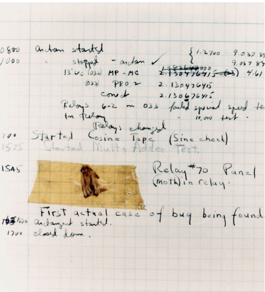

 
 
 
 
 
 
 
 
 
 
 
 
 
 
 
 
 
 
 
 

# 1947
## **Silicon Transistor (Transistor Silicon)**

###### **John Bardeen**(1908–1991), **Walter Houser Brattain**(1902–1987), **William Shockley**(1910–1989)
___

Transistor adalah saklar elektronik: arus mengalir dari satu terminal ke terminal lain kecuali tegangan diterapkan ke terminal ketiga. Dikombinasikan dengan hukum aljabar Boolean,perangkat sederhana ini telah menjadi blok bangunan untuk mikroprosesor, sistem memori, dan seluruh revolusi komputer.

Teknologi apa pun yang dapat menggunakan satu sinyal untuk menghidupkan dan mematikan sinyal lainnya dapat digunakan untuk membuat komputer. Charles Babbage melakukannya dengan batang, roda, dan tenaga uap. Konrad Zuse dan Howard Aiken melakukannya dengan relay, dan ENIAC menggunakan tabung.Setiap teknologi lebih cepat dan lebih dapat diandalkan dari sebelumnya.

Demikian juga, transistor memiliki beberapa keunggulan dibandingkan tabung vakum: mereka menggunakan lebih sedikit daya, sehingga menghasilkan lebih sedikit panas, beralih lebih cepat, dan kurang rentan terhadap kejutan fisik. Semua keuntungan ini muncul karena transistor lebih kecil dari tabung - dan semakin kecil transistor, semakin besar keuntungannya.

Tim Bell Labs membuat alat yang menempelkan dua lembar kertas emas ke kristal dan kemudian menerapkan kekuatan ke kristal itu germanium. Hasilnya adalah penguat: sinyal yang disuntikkan ke satu kawat lebih kuat ketika keluar dari yang lain. Hari ini kami menyebut perangkat ini sebagai transistor 
kontak titik. Untuk penemuan transistor mereka, Bardeen Brattain, dan Shockley dianugerahi Hadiah Nobel pada tahun 1956.

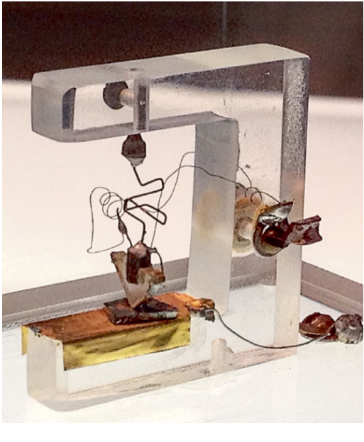

 
 
 
 
 
 
 
 
 
 
 
 
 
 
 
 
 
 
 
 

# 1948
## **The Bit (Sedikit)**

###### **Claude E. Shannon** (1916–2001), **John W. Tukey** (1915–2000)
___ 

Itu adalah matematikawan Jerman Gottfried Wilhelm Leibniz (1646-1716) yang pertama kali menetapkan aturan untuk melakukan aritmatika dengan bilangan biner. Hampir 250 tahun  kemudian, Claude E. Shannon menyadari bahwa angka biner - sebuah 0 atau 1 - adalah unit informasi yang fundamental dan tak terpisahkan.

Shannon memperoleh gelar PhD dari MIT pada tahun 1940 Kemudian, pada tahun 1948, Shannon menerbitkan "A Mathematical Theory of Communication" diJurnal Teknis Sistem Bel. Artikel tersebut sebagian terinspirasi oleh pekerjaan rahasia yang dilakukan Shannon tentang kriptografi selama perang. Di dalamnya, ia menciptakan definisi matematis dari sistem komunikasi umum, yang terdiri dari pesan yang akan dikirim, pemancar untuk mengubah pesan menjadi sinyal, saluran melalui mana sinyal dikirim, penerima, dan tujuan, seperti seseorang atau mesin "untuk siapa pesan itu dimaksudkan."

Makalah Shannon memperkenalkan kata bit, digit biner, sebagai unit dasar informasi. Karya Shannon menjelaskan hubungan antara informasi dan entropi, sehingga membangun hubungan antara komputasi dan fisika. Memang, fisikawan terkenal Stephen Hawking membingkai banyak analisisnya tentang lubang hitam dalam hal kemampuan untuk menghancurkan informasi dan masalah yang diciptakan sebagai hasilnya.

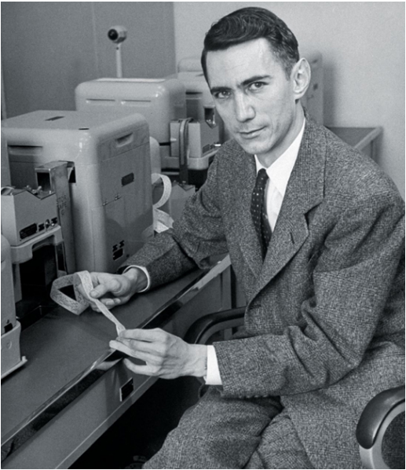

 
 
 
 
 
 
 
 
 
 
 
 
 
 
 
 
 
 
 
 

# 1948
## **Curta Calculator (Kalkulator Curta)**

###### **Curt Herzstark**(1902–1988)
___

Curta mungkin adalah kalkulator mekanik paling elegan ringkas, dan fungsional yang pernah diproduksi. Dirancang oleh insinyur Austria Curt Herzstark, ini adalah satu-satunya 
kalkulator saku mekanik digital yang pernah ditemukan. Digenggam dan ditenagai oleh engkol di bagian atas, Curta dapat menambah, mengurangi, mengalikan, dan membagi.

Ayah Curt Herzstark, Samuel Jacob Herzstark, adalah importir Austria yang sangat dihormati dan produsen kalkulator mekanik dan instrumen presisi lainnya. 

Pada saat itu, kalkulator mekanik adalah urusan desktop yang besar dan berat. Setelah salah satu pelanggan Herzstark mengeluh bahwa dia tidak ingin kembali ke  kantor hanya untuk menjumlahkan kolom angka, Herzstark mulai merancang kalkulator genggam.

Pada tahun 1943, dua karyawan Herzstark ditangkap karena mendistribusikan transkrip siaran radio Inggris; Herzstark kemudian ditangkap karena membantu karyawan dan karena "kontak tidak senonoh dengan wanita Arya." Dia dikirim ke kamp konsentrasi Buchenwald, di mana dia dikenali oleh salah satu mantan karyawannya, yang sekarang menjadi penjaga.

Penjaga itu memberi tahu kepala pabrik kamp tentang kalkulator mekanis. Setelah pembebasan, Herzstark membawa gambar yang telah dia buat di kamp ke toko mesin dan memiliki tiga prototipe yang berfungsi delapan minggu kemudian. Kalkulator pertama diproduksi secara komersial pada musim gugur 1948.

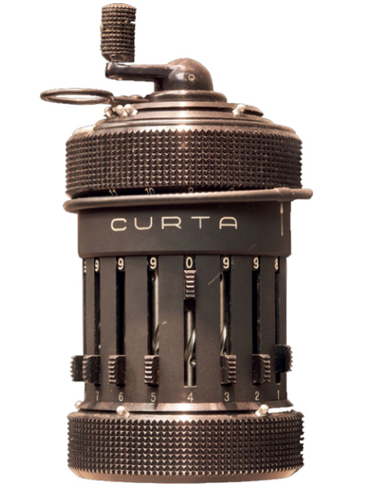

 
 
 
 
 
 
 
 
 
 
 
 
 
 
 
 
 
 
 
 

# 1948
## **Manchester SSEM**

###### **Frederic Calland Williams**(1911–1977), **Tom Kilburn**(1921–2001)
___

SSEM, dijuluki Bayi, oleh penciptanya di University of Manchester, dibangun untuk menguji dan mendemonstrasikan tabung penyimpanan yang dirancang Frederic Williams pada tahun 1946. Bayi mengisi ruangan seluas 20 kaki persegi dan terdiri dari delapan rak peralatan, tabung penyimpanan Williams, banyak radio tabung, dan meter yang melaporkan tegangan. Setiap tabung memiliki 1.024 bit. Saat program berjalan dan mengubah apa yang disimpan dalam memorinya, susunan titik-titik pada tabung penyimpanan berubah.

Karena program disimpan dalam memori, dan mengandalkan kode modifikasi sendiri, Kilburn mudah melakukan perubahan. Program pertama yang berhasil dijalankan Bayi, ditulis oleh Kilburn, dirancang untuk menemukan faktor tertinggi 2 18(262.144). Program berjalan dalam 52 menit dan menemukan jawaban yang benar: 217(131.072), rata-rata 1,5 milidetik per instruksi. Program aslinya hanya terdiri dari 17 instruksi.

Mencapai jawaban yang benar bukanlah hal yang mudah. Seperti yang dilaporkan Williams, “Bintik-bintik pada tabung tampilan memasuki tarian gila. Dalam uji coba awal, itu adalah tarian 
kematian yang tidak membawa hasil yang berguna. Tetapi suatu hari itu berhenti, dan di sana, bersinar terang di tempat yang diharapkan, adalah jawaban yang diharapkan.”

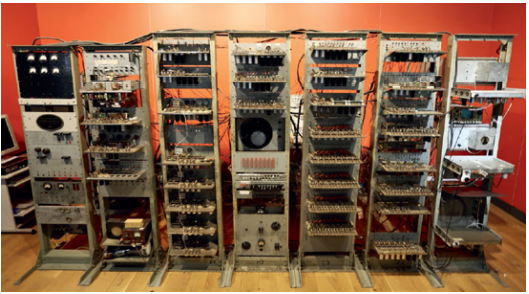

 
 
 
 
 
 
 
 
 
 
 
 
 
 
 
 
 
 
 
 

# 1949
## **Whirlwind (Angin Puyuh)**

###### **Jay Forrester** (1918–2016), **Robert R. Everett** (b. 1921)
___

Pada tahun 1944, Angkatan Laut US meminta Laboratorium Servomekanisme MIT untuk membuat simulator penerbangan untuk melatih pilot Angkatan Laut. MIT mencoba membangun komputer analog, tetapi jelas bahwa hanya mesin digital yang dapat menawarkan kecepatan, fleksibilitas, dan kemampuan program yang diperlukan untuk membuat simulasi realistis. Jadi, pada tahun 1945, Office of Naval Research mengontrak MIT untuk menciptakan apa yang akan menjadi komputer real - time interaktif pertama di dunia.

Whirlwind di telpon, mesin itu merupakan pekerjaan besar: proyek itu melibatkan 175 orang dengan anggaran $1 juta per tahun. Mesin tersebut menggunakan 3.300 tabung vakum dan menempati 3.300 kaki persegi di MIT Building N42, Sebuah
Bangunan dua lantai seluas 25.000 kaki persegi yang dibeli MIT khusus untuk proyek tersebut.

Whirlwind memiliki tampilan grafis komputer pertama, sepasang layar video 5 inci di mana komputer dapat menggambar peta wilayah udara. Ketika Whirlwind sebagian beroperasi pada tahun 1949, profesor MIT Charles Adams dan programmer John Gilmore Jr. menggunakan kemampuan grafisnya untuk membuat salah satu video game pertama: garis dengan lubang, dan bola yang membuat tunk berbunyi setiap kali memantul. Tujuannya adalah untuk memindahkan lubang sehingga bola akan jatuh.

Whirlwind beroperasi penuh pada tahun 1951. Meskipun tidak pernah benar-benar digunakan sebagai simulator penerbangan, tampilan grafisnya menunjukkan bahwa komputer dapat menyajikan peta dan melacak objek, menunjukkan kelayakan menggunakan komputer untuk pertahanan udara.

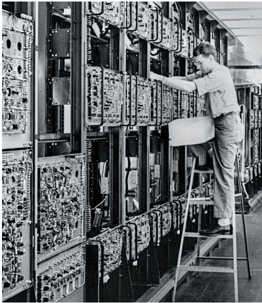

 
 
 
 
 
 
 
 
 
 
 
 
 
 
 
 
 
 
 
 

# 1950 
## **Error-Correcting Codes** 

###### **Richard Hamming** (1915–1998)
___

Setelah dia mendapatkan gelar PhD dalam matematika dan bekerja pada pemodelan matematika untuk bom atom, Richard Hamming mengambil pekerjaan di Bell Telephone Labs, di mana dia bekerja dengan Claude Shannon dan John Tukey dan menulis program untuk komputer laboratorium. Hamming memperhatikan bahwa mesin digital ini harus melakukan perhitungan mereka dengan sempurna. Tapi mereka tidak melakukannya. Menurut Hamming, komputer relai yang dibangun Bell untuk Aberdeen Proving Ground, fasilitas Angkatan Darat AS di Maryland, memiliki 8.900 relai dan biasanya mengalami dua atau tiga kegagalan per hari. Ketika kegagalan seperti itu terjadi, seluruh perhitungan akan rusak dan perlu dimulai kembali dari awal. Pada saat itu, menjadi populer bagi perancang komputer untuk mencurahkan bit ekstra, yang disebut bit paritas, untuk mendeteksi kesalahan saat data dikirim atau disimpan. Hamming beralasan bahwa jika mungkin untuk mendeteksi kesalahan secara otomatis, itu juga harus mungkin untuk memperbaikinya secara otomatis. Dia menemukan cara untuk melakukan ini dan menerbitkan artikel seminalnya, “Error Detecting and Error Correcting Codes,” di Bell System Technical Journal edisi April 1950. Kode koreksi kesalahan (ECC) memainkan peran penting dalam meningkatkan keandalan sistem komputer modern. Tanpa ECC, setiap kali ada kesalahan kecil pada penerimaan data, pengirim harus mengirim ulang. Jadi sistem data seluler modern menggunakan ECC untuk memungkinkan penerima memperbaiki kesalahan kecil tersebut, tanpa meminta pengirim mengirimkan ulang salinan yang bersih. Saat ini ECC juga digunakan untuk memperbaiki kesalahan dalam data yang disimpan. Misalnya, sinar kosmik dapat mengacak bit chip memori akses acak dinamis (DRAM), jadi server internet biasanya dilindungi dengan memori ECC, memungkinkan mereka untuk secara otomatis memperbaiki sebagian besar kesalahan akibat radiasi latar belakang yang menyimpang. Compact disc (CD) dan digital video disc (DVD) menggunakan ECC untuk membuat pemutarannya tidak terpengaruh oleh goresan permukaan. Dan semakin, ECC sedang dimasukkan ke dalam protokol komunikasi nirkabel berkinerja tinggi untuk mengurangi kebutuhan data yang akan dikirim ulang jika terjadi gangguan. Hamming dianugerahi 1968 A.M. Turing Award “atas karyanya pada metode numerik, sistem pengkodean otomatis, dan kode pendeteksi kesalahan dan koreksi kesalahan.” 
LIHAT JUGA The Bit (1948)

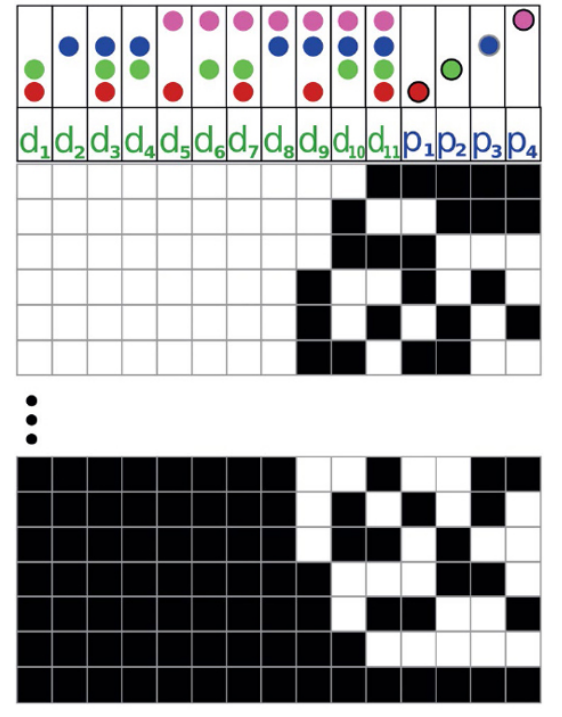
*Gambar aja.*

 
 
 
 
 
 
 
 
 
 
 
 
 
 
 
 
 
 
 
 

# 1951
## **Tes Turing** 

###### **Alan Turing** (1912–1954)
___

  
“Dapatkah mesin berpikir?” Itulah pertanyaan yang diajukan Alan Turing dalam makalahnya tahun 1951, “Mesin Komputasi dan Kecerdasan.” Turing membayangkan suatu hari ketika komputer akan memiliki penyimpanan dan kompleksitas sebanyak otak manusia. Ketika komputer memiliki begitu banyak penyimpanan, dia beralasan, seharusnya memungkinkan untuk memprogram berbagai macam fakta dan tanggapan sehingga sebuah mesin mungkin tampak cerdas. Lalu, bagaimana, tanya Turing, seseorang dapat mengetahui apakah sebuah mesin benar-benar cerdas, atau hanya menampilkan seperti itu? Solusi Turing adalah merancang tes kecerdasan mesin. Tanda kecerdasan, menurut Turing, bukanlah kemampuan untuk mengalikan angka besar atau bermain catur, tetapi untuk terlibat dalam percakapan alami dengan makhluk cerdas lainnya. Dalam pengujian Turing, seorang manusia, yang berperan sebagai interogator, dapat berkomunikasi (dalam apa yang sekarang kita sebut ruang obrolan) dengan dua entitas lain: manusia lain dan komputer. Tugas interogator adalah membedakan manusia dari komputer; tujuan komputer adalah untuk meyakinkan interogator bahwa itu adalah seseorang, dan bahwa orang lain hanyalah simulasi kecerdasan. Jika sebuah komputer dapat lulus ujian seperti itu, tulis Turing, maka akan ada banyak alasan untuk berasumsi bahwa komputer itu sadar seperti halnya asumsi bahwa setiap manusia sadar. Menurut Turing, cara termudah untuk membuat komputer yang dapat lulus ujiannya adalah dengan membangun komputer yang dapat belajar dan kemudian mengajarkannya sejak "lahir" seolah-olah ia masih anak-anak. Pada tahun-tahun berikutnya, program yang disebut chatbots, yang mampu melakukan percakapan, tampaknya lulus ujian dengan membodohi manusia yang tidak curiga dengan berpikir bahwa mereka cerdas. Yang pertama, ELIZA, ditemukan pada tahun 1966 oleh profesor MIT Joseph Weizenbaum (1923–2008). Dalam satu kasus, ELIZA dibiarkan berjalan di teletype, dan seorang pengunjung ke kantor Weizenbaum mengira dia sedang mengobrol teks dengan Weizenbaum di kantor rumahnya, bukan dengan program kecerdasan buatan (AI). Menurut para ahli, bagaimanapun, ELIZA tidak lulus tes Turing karena pengunjung tidak diberitahu sebelumnya bahwa "orang" di ujung teleprinter mungkin adalah komputer.

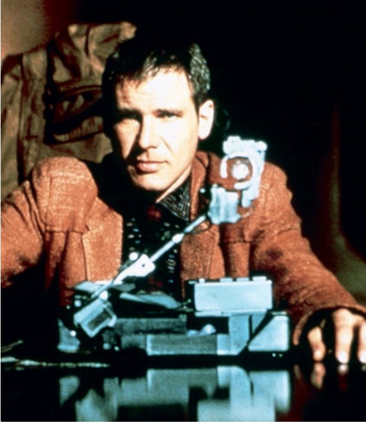
*Alan*

 
 
 
 
 
 
 
 
 
 
 
 
 
 
 
 
 
 
 
 

  # 1951
## **Pita Magnetik Digunakan untuk Komputer** 

###### **Fritz Pfleumer**  (1881–1945)
___

   Gulungan pita magnetik yang berputar adalah penanda visual ikonik dari sistem komputer selama lebih dari empat dekade dalam budaya populer. Mungkin ini karena gulungan, bergerak maju mundur dengan tujuan yang jelas, entah bagaimana menyampaikan pemikiran dan pergerakan informasi dengan cara yang tidak pernah bisa dilakukan oleh lampu yang berkedip. Pada tahun 1951, teknologi pita magnetik, yang disempurnakan selama 75 tahun sebelumnya untuk merekam suara, menemukan jalannya ke komputer UNIVAC awal yang dibuat oleh Eckert-Mauchly Computer Corporation. UNIVAC adalah salah satu komputer pertama yang diproduksi secara komersial dan dapat melakukan perhitungan jauh lebih cepat daripada yang bisa dilakukan manusia. Data dan program disimpan pada pita magnetik dan dimuat ke dalam memori komputer untuk perhitungan, dan hasilnya dicetak atau ditulis ke tape drive lain. UNIVAC menggunakan pita logam (perekam audio awal menyimpan suara manusia pada gulungan panjang kawat dan pita logam tipis) yang melaju dengan kecepatan 100 inci (2,5 meter) per detik; pita tunggal memiliki panjang 1.200 kaki (365,76 meter) dan lebar setengah inci (13 milimeter), dan dapat menyimpan sekitar 1 juta karakter 6-bit. IBM mengikuti pada tahun 1952 dengan 726 tape drive untuk komputer IBM 701. 726 memiliki kinerja yang mirip dengan pita UNIVAC, tetapi menggunakan pita selulosa asetat yang dilapisi dengan senyawa oksida besi, sebuah teknologi yang telah terbukti unggul dalam perekaman audio karena lebih ringan dan lebih murah untuk diproduksi. Drive 727 IBM, yang diumumkan pada tahun berikutnya, menggandakan kapasitas dan tingkat penyimpanan. Pita logam sudah mati, dan IBM terus menjual drive 727 sampai tahun 1971. Meskipun pita magnetik jauh lebih cepat daripada kartu punch dan pita kertas, ketiga teknologi digunakan berdampingan selama beberapa dekade — terkadang di komputer yang sama — karena perbedaannya. karakteristik kinerja dan biaya. Sebagai contoh, pada tahun 1960-an, merupakan hal yang biasa bagi siswa untuk memasukkan program mereka ke dalam tumpukan kartu punch menggunakan pukulan kunci yang relatif murah, kemudian kartu tersebut dimuat ke pita oleh operator komputer, dan akhirnya memiliki pita itu, dengan banyak program dari banyak siswa yang berbeda, dijalankan melalui komputer selama shift tengah malam, ketika komputer tidak digunakan.

   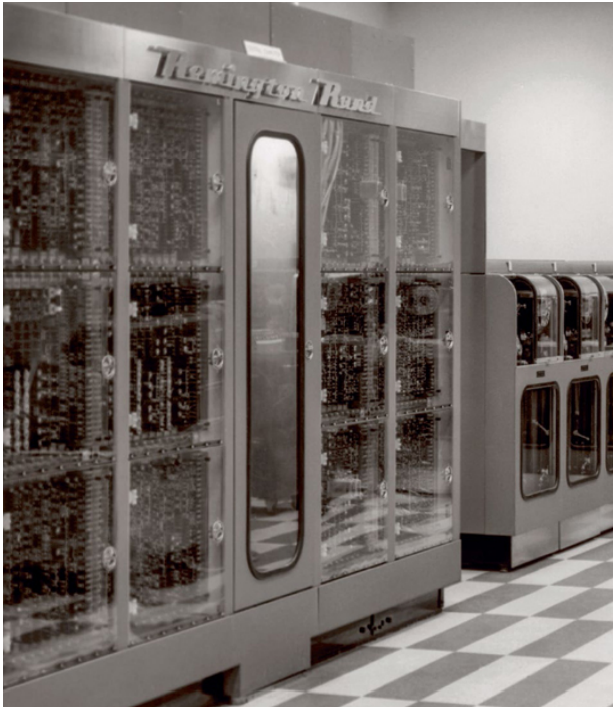
   *Pita magnetik*

 
 
 
 
 
 
 
 
 
 
 
 
 
 
 
 
 
 
 
 

 # 1951
## **Memori Inti** 

###### **An Wang**   (1920–1990), **Jay Forrester** (1918–2016)
___

 Komputer pertama tidak memiliki memori yang dapat ditulis ulang. Sebaliknya, mereka "terprogram" untuk membaca input, melakukan perhitungan, dan mengeluarkan hasilnya. Tetapi segera menjadi jelas bahwa memori utama yang dapat ditulis ulang dapat digunakan untuk menyimpan program, membuatnya lebih mudah untuk dikembangkan dan di-debug, serta data, sehingga memungkinkan komputer untuk melakukan perhitungan pada masalah yang jauh lebih besar. Memori inti bekerja dengan menginduksi medan magnet menjadi cincin magnet kecil, atau inti. Setiap inti dimagnetisasi searah jarum jam atau berlawanan arah jarum jam, secara alami memungkinkan inti untuk menyimpan satu bit. Bit disimpan dengan mengirimkan pulsa listrik di sepanjang sepasang kabel horizontal dan vertikal yang bersilangan pada inti tertentu, dengan satu arah aliran magnet menyimpan 0 dan yang lainnya a 1. Kawat ketiga yang mengalir melalui setiap inti digunakan untuk membaca apa sebelumnya telah disimpan. Memori inti memiliki keuntungan mengingat isinya bahkan ketika daya telah dihapus. Kerugian besar adalah bahwa inti harus dirangkai dengan tangan ke dalam sistem memori, itulah sebabnya memori inti sangat mahal untuk diproduksi. Insinyur komputer An Wang mengemukakan dasar-dasar bagaimana membuat memori inti bekerja saat berkolaborasi dengan Howard Aiken pada komputer Harvard Mark IV; dia mengajukan paten atas penemuan tersebut pada tahun 1949. Tetapi Harvard kehilangan minat dalam komputasi, jadi pada tahun 1951, Wang pergi dan memulai perusahaannya sendiri, Wang Laboratories. IBM membeli paten dari Wang Laboratories seharga $500.000 pada tahun 1956. Sementara itu di MIT, profesor Jay Forrester melihat sebuah iklan untuk bahan magnet baru, menyadari bahwa itu dapat digunakan untuk menyimpan data, dan membangun sistem prototipe yang menyimpan 32 bit data. Pada saat itu, MIT sedang membangun komputer Whirlwind untuk membuat simulator penerbangan terkomputerisasi pertama. Angin puyuh dirancang untuk menggunakan sistem memori elektrostatik berdasarkan tabung penyimpanan, tetapi para insinyur MIT tidak dapat membuat tabung itu bekerja. Bekerja dengan seorang mahasiswa pascasarjana, Forrester menghabiskan dua tahun dan menciptakan sistem memori inti praktis pertama, menyimpan 1.024 bit data (1 kibibit) dalam array 32 × 32 core. Memori tersebut dipasang di Whirlwind pada April 1951. Pada tahun yang sama, Forrester mengajukan paten pada teknik yang lebih efisien dalam mengatur inti dalam susunan tiga dimensi. IBM membeli paten itu dari MIT seharga 13 juta dolar pada tahun 1964.

 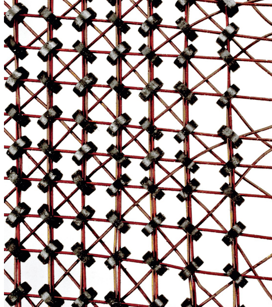
 *Memory Komputer*

 
 
 
 
 
 
 
 
 
 
 
 
 
 
 
 
 
 
 
 

 # 1951
## **Pemrograman Mikro** 

###### **Maurice Wilkes** (1913–2010)
___

 Pada tahun 1951, struktur dasar komputer program tersimpan telah berhasil dibuat: unit pemrosesan pusat (CPU) yang memiliki register untuk menyimpan angka, unit logika aritmatika (ALU) untuk melakukan operasi matematika , dan logika untuk memindahkan data antara CPU dan memori. Tapi desain internal CPU awal ini berantakan. Setiap instruksi diimplementasikan dengan rangkaian kabel dan sirkuit yang berbeda, beberapa dengan komponen yang sama, dan yang lainnya dengan logika masing-masing. Ilmuwan komputer Inggris Maurice Wilkes menyadari bahwa desain CPU dapat dibuat lebih teratur setelah melihat desain Angin Puyuh, yang dikendalikan oleh matriks kabel yang saling bersilangan. Beberapa kabel dihubungkan oleh dioda di mana mereka bersilangan. Tegangan diterapkan ke setiap kawat horizontal secara berurutan. Jika ada dioda, kabel vertikal yang sesuai akan diberi energi dan mengaktifkan berbagai bagian CPU. Wilkes menyadari bahwa setiap baris matriks dioda dalam Angin Puyuh dapat dilihat sebagai satu set operasi mikro yang diikuti CPU, semacam "program mikro." Dia meresmikan ide ini dalam sebuah kuliah di Konferensi Peresmian Komputer Universitas Manchester 1951, dengan tidak sopan berjudul "Cara Terbaik untuk Merancang Mesin Penghitung Otomatis." Dalam kuliah, yang kemudian diterbitkan oleh universitas, Wilkes mengusulkan bahwa idenya mungkin tampak jelas sekaligus, karena itu menggambarkan tidak lebih dari cara formal untuk membuat CPU menggunakan kabel dasar yang sama, dioda, dan sakelar elektronik yang sudah digunakan. , serta boros, karena mungkin menggunakan lebih banyak komponen daripada yang akan digunakan sebaliknya. Tapi, menurut Wilkes, itu menghasilkan sistem yang lebih mudah untuk dirancang, diuji, dan diperluas. Wilkes benar. Pemrograman mikro secara dramatis menyederhanakan pembuatan CPU, memungkinkan set instruksi menjadi lebih kompleks. Itu juga menciptakan fleksibilitas yang tidak terduga: ketika IBM merilis System

 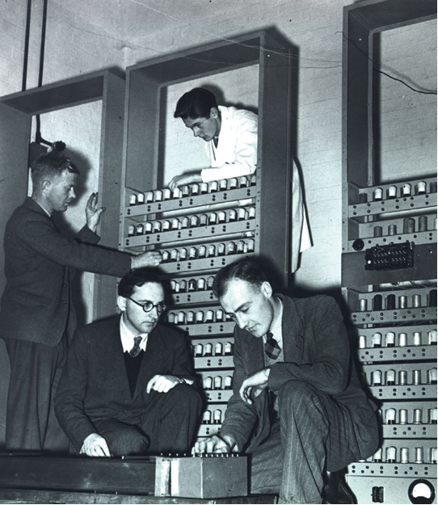
 *Maurice Wilkes (kiri depan), perancang EDSAC, salah satu komputer elektronik program tersimpan paling awal.*

 
 
 
 
 
 
 
 
 
 
 
 
 
 
 
 
 
 
 
 

 # 1952
## **Pengenalan Ucapan Komputer** 
___

Sistem pengenalan angka otomatis, juga dikenal sebagai Audrey, dikembangkan oleh Bell Labs pada tahun 1952. Audrey adalah tonggak sejarah dalam upaya untuk memungkinkan komputer mengenali dan merespons ucapan manusia. Audrey dirancang untuk mengenali angka yang diucapkan 0 hingga 9 dan memberikan umpan balik dengan serangkaian lampu berkedip yang terkait dengan angka tertentu. Keakuratan Audrey bergantung pada pembicara, karena untuk bekerja, pertama-tama ia harus "mempelajari" suara unik yang dipancarkan oleh seseorang untuk bahan referensi. Akurasi Audrey sekitar 80 persen dengan suara seorang desainer. Pengenalan speaker-independen tidak akan ditemukan selama bertahun-tahun, dengan contoh modern adalah Amazon® Echo® dan Apple Siri. Untuk membuat bahan referensi, pembicara perlahan-lahan akan melafalkan angka 0 sampai 9 ke telepon sehari-hari, jeda setidaknya 350 milidetik antara setiap nomor. Suara-suara itu kemudian disortir ke dalam kelas-kelas listrik dan disimpan dalam memori analog. Jeda diperlukan karena pada saat itu, sistem pengenalan ucapan belum memecahkan koartikulasi—fenomena penutur yang menghubungkan kata-kata secara fonetis saat mereka secara alami berubah dari satu ke yang lain. Artinya, lebih mudah bagi sistem untuk mengisolasi dan mengenali kata-kata individual daripada kata-kata yang diucapkan bersama-sama. Setelah dilatih, Audrey dapat mencocokkan angka yang diucapkan baru dengan suara yang tersimpan dalam memorinya: komputer akan menyalakan lampu yang sesuai dengan angka tertentu ketika menemukan kecocokan. Sementara berbagai kepraktisan ekonomi dan teknis mencegah Audrey masuk ke produksi (termasuk sirkuit terprogram khusus dan konsumsi daya yang besar), Audrey tetap merupakan blok bangunan penting dalam memajukan pengenalan suara. Audrey menunjukkan bahwa teknik ini secara teori dapat digunakan untuk mengotomatiskan input pembicara untuk hal-hal seperti nomor rekening, nomor Jaminan Sosial, dan jenis informasi numerik lainnya. Sepuluh tahun kemudian, IBM mendemonstrasikan “Shoebox”, sebuah mesin yang mampu mengenali 16 kata yang diucapkan, di Pameran Dunia 1962 di Seattle, Washington.

 
 *Sistem pengenalan digit otomatis merupakan cikal bakal banyak aplikasi populer saat ini, termasuk smartphone yang dapat mengenali perintah suara.*

 
 
 
 
 
 
 
 
 
 
 
 
 
 
 
 
 
 
 
 

 # 1953
## **Komputer Transistorisasi Pertama** 

###### **Tom Kilburn** (1921–2001), **Richard Grimsdale** (1929–2005), **Douglas Webb** (lahir 1929), **Jean H. Felker** (1919–1994)
___

 Dengan ditemukannya transistor pada tahun 1947, langkah selanjutnya adalah untuk menggunakannya sebagai pengganti tabung vakum. Tabung memiliki keuntungan yang signifikan dibandingkan dengan relai — mereka seribu kali lebih cepat — tetapi tabung membutuhkan listrik yang sangat banyak, menghasilkan panas dalam jumlah besar, dan gagal terus-menerus. Transistor menggunakan sebagian kecil daya, praktis tidak menghasilkan panas sama sekali, dan lebih andal daripada tabung. Dan karena transistor lebih kecil dari tabung, mesin yang ditransistorisasi akan berjalan secara inheren lebih cepat, karena elektron memiliki jarak yang lebih pendek untuk bergerak. University of Manchester mendemonstrasikan prototipe komputer bertransistor pada 16 November 1953. Mesin tersebut menggunakan transistor "pointcontact", sepotong germanium yang bersentuhan dengan dua kabel yang dipegang sangat dekat satu sama lain—dua "titik" .” Mesin Manchester memiliki 92 transistor titik-kontak dan 550 dioda. Sistem memiliki ukuran kata 48 bit. (Banyak mikroprosesor saat ini dapat beroperasi pada kata-kata yang 8, 16, 32, atau 64 bit.) Beberapa bulan kemudian, Jean H. Felker di Bell Labs menciptakan TRADIC (komputer digital transistor) untuk Angkatan Udara AS, dengan 700 transistor titik-kontak dan lebih dari 10.000 dioda. Transistor titik-kontak ini segera digantikan oleh transistor sambungan bipolar, dinamakan demikian karena dibentuk oleh sambungan yang melibatkan dua jenis semikonduktor. Manchester memperbarui prototipenya pada tahun 1955 dengan desain baru yang menggunakan 250 transistor persimpangan ini. Disebut Metrovick 950, komputer itu diproduksi oleh Metropolitan-Vickers, sebuah perusahaan teknik listrik Inggris. Pada tahun 1956, Advanced Development Group di MIT Lincoln Lab menggunakan lebih dari 3.000 transistor untuk membangun TX-0 (Transistorized eXperimental computer zero), versi Whirlwind yang ditransistorisasi dan pendahulu Digital Equipment Corporation (DEC®) PDP-1.

 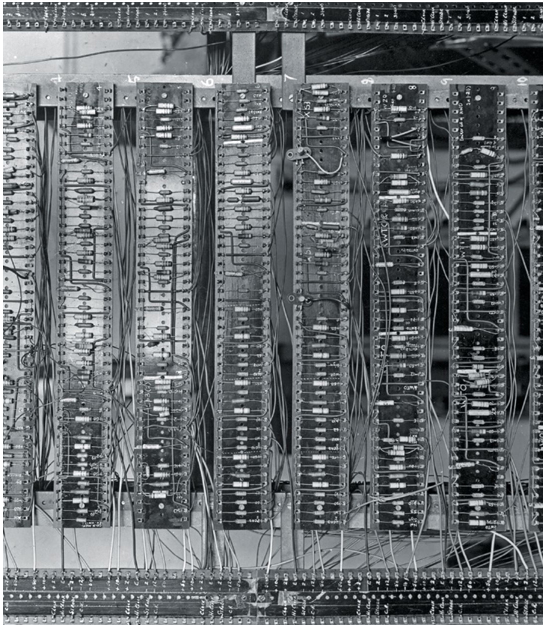
 *Tampilan jarak dekat dari prototipe komputer bertransistor Manchester.*

 
 
 
 
 
 
 
 
 
 
 
 
 
 
 
 
 
 
 
 

 # 1955
## **Kecerdasan Buatan Diciptakan** 

###### **John McCarthy** (1927–2011), **Marvin Minsky** (1927–2016), **Nathaniel Rochester** (1919–2001), **Claude E. Shannon** (1916–2001) 
___

 Kecerdasan buatan (AI) adalah ilmu komputer yang melakukan hal-hal yang biasanya membutuhkan kecerdasan manusia untuk mencapainya. Istilah ini diciptakan pada tahun 1955 oleh John McCarthy, Marvin Minsky, Nathaniel Rochester, dan Claude Shannon dalam proposal mereka untuk "Proyek Penelitian Musim Panas Dartmouth tentang Kecerdasan Buatan," sebuah lembaga dua bulan, 10 orang yang diadakan di Dartmouth College selama musim panas 1956. Hari ini kami menganggap penulis proposal sebagai "bapak pendiri" AI. Minat utama mereka adalah meletakkan dasar bagi generasi mesin masa depan yang akan menggunakan abstraksi untuk membuat mereka mencerminkan cara berpikir manusia. Jadi para pendiri memulai berbagai proyek penelitian yang berbeda, termasuk upaya untuk memahami bahasa tertulis, memecahkan masalah logika, menggambarkan adegan visual, dan cukup banyak meniru apa pun yang bisa dilakukan otak manusia. Istilah kecerdasan buatan telah masuk dan keluar dari mode selama bertahun-tahun, dengan orang-orang menafsirkan konsep tersebut dengan cara yang berbeda. Ilmuwan komputer mendefinisikan istilah tersebut sebagai menggambarkan pengejaran akademis seperti visi komputer, robotika, dan perencanaan, sedangkan masyarakat — dan budaya populer — cenderung berfokus pada aplikasi fiksi ilmiah seperti kognisi mesin dan kesadaran diri. Di Star Trek (“The Ultimate Computer,” 1968), komputer M5 berbasis AI dapat menjalankan kapal luar angkasa tanpa awak manusia—lalu dengan cepat mengamuk dan mulai menghancurkan kapal luar angkasa lainnya selama latihan. Film Terminator menghadirkan Skynet sebagai jaringan AI global yang bertekad menghancurkan seluruh umat manusia. Baru belakangan ini AI diterima dalam leksikon publik sebagai teknologi yang sah dengan aplikasi praktis. Alasannya adalah keberhasilan sistem AI yang terfokus secara sempit yang telah mengungguli manusia dalam tugas-tugas yang membutuhkan kecerdasan manusia yang luar biasa. Saat ini AI dibagi menjadi banyak subbidang, termasuk pembelajaran mesin, pemrosesan bahasa alami, jaringan saraf, pembelajaran mendalam, dan lainnya. Untuk pekerjaan mereka di AI, Minsky dianugerahi A.M. Penghargaan Turing pada tahun 1969, dan McCarty pada tahun 1971.

 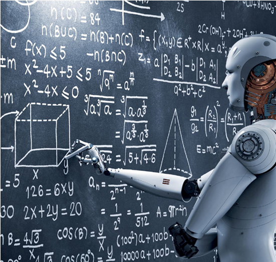
 *Kecerdasan buatan memungkinkan komputer untuk melakukan hal-hal yang biasanya membutuhkan kecerdasan manusia, seperti mengenali pola, mengklasifikasikan objek, dan belajar.*

 
 
 
 
 
 
 
 
 
 
 
 
 
 
 
 
 
 
 
 

 # 1955
## **Komputer Membuktikan Teorema Matematika** 

###### **Allen Newell** (1927–1992), **John Clifford Shaw** (1922–1991), **Herbert Simon** (1916–2001)
___

“Agak kasar, tapi berhasil, nak, berhasil!” Demikian kata Allen Newell kepada Herb Simon pada Hari Natal 1955, tentang program yang mereka berdua tulis dengan bantuan pemrogram komputer John Clifford Shaw. Program, Logic Theorist, telah diberikan definisi dasar dan aksioma matematika dan diprogram untuk menggabungkan simbol secara acak ke dalam pernyataan matematika yang kompleks secara berurutan dan kemudian memeriksa validitasnya masing-masing. Jika program menemukan pernyataan yang benar, ia menambahkan pernyataan itu ke daftar kebenarannya dan terus berjalan. Seperti yang dikatakan Newell, pendekatannya agak kasar, tetapi berhasil. Saat Ahli Teori Logika berlari, ia menemukan semakin banyak kebenaran matematis. Seiring waktu, program ini membuktikan 38 dari 52 teorema di Principia Mathematica, teks klasik tentang matematika yang ditulis oleh Alfred Whitehead (1861–1947) dan Bertrand Russell (1872–1970). Simon mengirim surat kepada Lord Russell yang memberi tahu dia tentang kontribusi program. Dalam satu kasus, ternyata Ahli Teori Logika telah menemukan bukti salah satu teorema Russell yang lebih elegan daripada yang diterbitkan dalam teks. Russell dengan masam membalas, ”Saya senang mengetahui bahwa 'Principia Mathematica' sekarang dapat dilakukan dengan mesin. Saya berharap Whitehead dan saya mengetahui kemungkinan ini sebelum kami menyia-nyiakan 10 tahun melakukannya dengan tangan.” Bagi Newell, Shaw, dan Simon, program mereka menyalakan harapan bahwa banyak rahasia pemikiran dan kecerdasan akan terbongkar hanya dalam beberapa tahun. Ketika mereka menulis Logic Theorist, Newell dan Shaw keduanya peneliti komputer di RAND Corporation, sebuah think tank penelitian dan pengembangan. Simon, seorang ilmuwan politik dan ekonom di Carnegie Mellon, bekerja untuk RAND sebagai konsultan. Newell akhirnya pindah ke Carnegie Mellon, di mana dia dan Simon memulai salah satu laboratorium AI pertama. Bersama-sama Newell dan Simon berbagi tahun 1975 A.M. Turing Award untuk pekerjaan mereka di AI.

 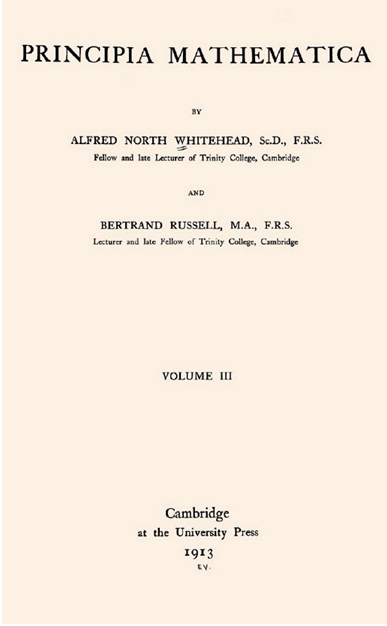
 *Untuk menulis Principia Mathematica, Whitehead dan Russell dengan susah payah menurunkan sebagian besar matematika modern dari sejumlah kecil aksioma dan aturan inferensi. Menggunakan pendekatan serupa, program Logic Theorist juga dapat menemukan dan membuktikan kebenaran matematika*

 
 
 
 
 
 
 
 
 
 
 
 
 
 
 
 
 
 
 
 

 # 1956
## **Unit Penyimpanan Disk Pertama** 

###### **Reynold B. Johnson** (1906–1998)
___

 Lebih cepat dari tape tetapi lebih lambat dari memori utama, drive disk magnetik telah menjadi bagian penting dari komputasi sejak ditemukan oleh IBM dan didemonstrasikan secara publik pada 14 September 1956. IBM 305 RAMAC (Metode Akses Acak Akuntansi dan Kontrol) dirancang untuk menyimpan file akuntansi dan inventaris yang sebelumnya telah disimpan sebagai kotak kartu punch IBM atau pada pita. Untuk melakukan ini, RAMAC dikirimkan dengan unit penyimpanan disk IBM 350, perangkat baru yang menyimpan data pada 50 disk yang berputar, masing-masing berdiameter 24 inci (61 sentimeter) dan berputar pada 1.200 putaran per menit (RPM). Disusun dalam blok 100 karakter yang dapat diakses, dibaca, dan ditulis ulang secara acak, RAMAC memungkinkan komputer dengan hanya beberapa kilobyte memori utama untuk mengakses 5 juta karakter dengan cepat—setara dengan 64.000 kartu punch. Tidak seperti drive modern, yang memiliki kepala untuk setiap disk, RAMAC memiliki satu kepala yang bergerak ke atas dan ke bawah untuk memilih disk, dan kemudian masuk dan keluar untuk memilih blok tertentu di mana data akan dibaca atau ditulis. Waktu akses rata-rata adalah enam persepuluh detik. RAMAC juga dilengkapi dengan memori drum berputar yang berputar pada 6.000 RPM dan menyimpan 3.200 karakter pada 32 trek yang masing-masing berisi 100 karakter. Selama 60 tahun berikutnya, kapasitas sistem disk-drive meningkat dari 3 megabyte menjadi 10 terabyte—faktor 3 juta—berkat perbaikan elektronik, pelapis magnetik, kepala drive, dan sistem pemosisian kepala mekanis. Tetapi waktu yang dibutuhkan disk untuk memposisikan ulang kepalanya untuk membaca data, sesuatu yang disebut waktu pencarian, hanya turun dari rata-rata 600 milidetik menjadi 4,16 milidetik, faktor hanya 144. Itu karena pengurangan waktu pencarian bergantung pada peningkatan mekanis sistem, yang, tidak seperti elektronik, tunduk pada kendala akibat gesekan dan momentum: selama bertahun-tahun sejak RAMAC diperkenalkan, tingkat rotasi hanya meningkat dari 1.200 RPM menjadi 10.000 RPM bahkan untuk hard drive paling mahal sekalipun.

 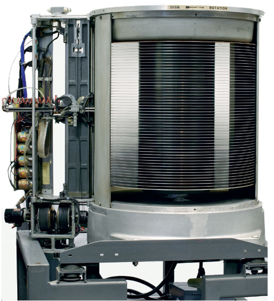
 *aktuator RAMAC dan tumpukan disk, dengan lima puluh disk 24 inci (61 sentimeter) yang berputar pada 1.200 RPM, menyimpan 5 juta karakter informasi*

 
 
 
 
 
 
 
 
 
 
 
 
 
 
 
 
 
 
 
 

 # 1956
## **Byte** 

###### **Werner Buchholz** (b. 1922), **Louis G. Dooley** (tanggal tidak tersedia)
___

Perancang komputer biner awal menghadapi pertanyaan mendasar: bagaimana
haruskah penyimpanan komputer diatur? Komputer yang disimpan
informasi dalam bit, tetapi pengguna komputer tidak ingin menulis program yang
bit yang dimanipulasi; mereka ingin memecahkan masalah matematika, memecahkan kode, dan
umumnya bekerja dengan unit informasi yang lebih besar. Memori desimal
komputer seperti ENIAC dan UNIVAC I diatur dalam kelompok
10 digit alfanumerik, yang disebut kata. Komputer biner juga terorganisir
memori mereka menjadi kata-kata, tetapi kelompok bit ini disebut byte.
Tampaknya kata byte diciptakan secara bersamaan pada tahun 1956 oleh
Werner Buchholz di IBM, mengerjakan IBM STRETCH (yang pertama di dunia)
supercomputer), dan oleh Louis G. Dooley dan lainnya di MIT Lincoln Lab
bekerja pada sistem pertahanan udara SAGE. Dalam kedua kasus, mereka menggunakan kata
byte untuk menggambarkan input dan output dari instruksi mesin yang dapat
beroperasi pada kurang dari satu kata penuh. STRETCH memiliki kata-kata 60-bit dan digunakan
Byte 8-bit untuk mewakili karakter untuk sistem input/outputnya; orang bijak
memiliki instruksi yang dapat beroperasi pada byte 4-bit.
Selama 20 tahun berikutnya, definisi byte agak berubah-ubah. IBM
menggunakan byte 8-bit dengan arsitektur System/360-nya, dan grup 8-bit adalah
standar untuk saluran telepon digital jarak jauh AT&T. DES, pada
sisi lain, berhasil memasarkan serangkaian komputer dengan 18-bit dan 36-
bit word, termasuk PDP-7 dan PDP-10, yang keduanya menggunakan 9-bit
byte.
Kurangnya konsistensi ini mengakibatkan standar internet awal menghindari
kata byte sepenuhnya. Sebaliknya, kata oktet digunakan untuk menggambarkan sekelompok
8 bit dikirim melalui jaringan komputer, penggunaan yang bertahan hingga hari ini di
standar internet.
Namun demikian, pada 1980-an, penerimaan byte 8-bit hampir
universal—sebagian besar merupakan hasil dari revolusi komputer mikro, karena mikro
menggunakan byte 8-bit hampir secara eksklusif. Sebagian, itu karena 8 bit adalah genap
kekuatan 2, yang membuatnya lebih mudah untuk merancang perangkat keras komputer
dengan byte 8-bit dibandingkan dengan byte 9-bit.
Hari ini era byte 9-bit sudah dilupakan. Dan bagaimana dengan
koleksi 4 bit? Hari ini ini disebut camilan (kadang-kadang dieja
nybel).

 
 *Komputer saat ini paling sering menggunakan byte yang terdiri dari 8 bit, diwakili oleh 1s dan 0s.*

 
 
 
 
 
 
 
 
 
 
 
 
 
 
 
 
 
 
 
 

 # 1956
## **Robby si Robot** 
___

Robby si Robot melakukan debut dunianya sebagai karakter fiksi dalam film Forbidden Planet, tahun yang sama ketika penggorengan antilengket dipasarkan dan hovercraft ditemukan. Pada 1950-an, dampak dan potensi penerapan teknologi—baik dan buruk—muncul dalam berbagai bentuk dalam budaya populer, serta menyebar ke rumah sebagai komoditas dalam berbagai bentuk. Dikenal karena kepribadiannya yang cerdas dan kehadiran visualnya yang unik, Robby adalah simbol dari tema yang lebih dalam dan kecemasan publik terhadap kemajuan teknologi. Dapat dipercaya sebagai karakter nyata dan sebagai robot, Robby dengan cepat menjadi simbol abadi dari janji robot yang ramah dan membantu — meskipun Robby sebenarnya adalah orang yang berjalan-jalan di dalam tabung plastik bentuk vakum 6 kaki 11 inci. Dalam film Forbidden Planet, Robby adalah ciptaan Dr. Morbius, yang membangunnya menggunakan cetak biru ras alien yang disebut Krell yang hidup satu milenium sebelumnya. Krell pernah tinggal di planet Altair IV, sekarang menjadi rumah bagi Dr. Morbius dan putrinya, satu-satunya yang selamat dari ekspedisi ilmuwan yang dikirim ke planet itu dua dekade sebelumnya. Terlepas dari nada mengancam dari poster pemasaran untuk Planet Terlarang, yang menunjukkan Robby menggendong seorang wanita yang terluka, Dr. Morbius memprogram Robby untuk mematuhi Tiga Hukum Robotika Isaac Asimov, yang menyatakan bahwa robot melindungi dan mematuhi manusia. Setelah debut filmnya, Robby muncul di lusinan film dan acara TV, termasuk The Invisible Boy, Lost in Space, The Twilight Zone, Mork & Mindy, dan iklan AT&T 2006 di mana ia muncul bersama robot terkenal lainnya, termasuk Rosie dari The Jetsons dan KITT dari Knight Rider. Robby benar-benar mesin yang canggih, dengan kemampuan berkomunikasi dengan lancar dalam 187 bahasa dan memasak makanan Dr. Morbius dengan mereproduksi molekul dalam bentuk dan jumlah apa pun. Robby—seperti R.U.R. pada tahun 1920 dan Maria dari Metropolis pada tahun 1927, membantu membayangkan bagi para ilmuwan komputer dan masyarakat umum tentang potensi teknis dan praktis komputer dan peran yang dapat dimainkan mesin tersebut dalam masyarakat manusia. Robby adalah inspirasi bagi para ilmuwan komputer dan penemu pemula seperti halnya ia adalah seorang penghibur bagi masyarakat umum.

 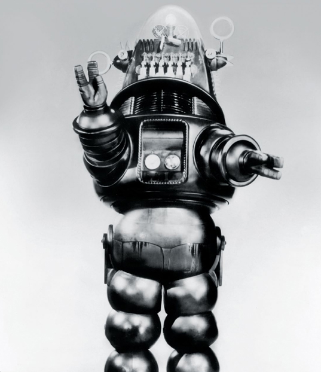
 *Robby the Robot, dari film Forbidden Planet, 1956*

 
 
 
 
 
 
 
 
 
 
 
 
 
 
 
 
 
 
 
 

</body>
</html>