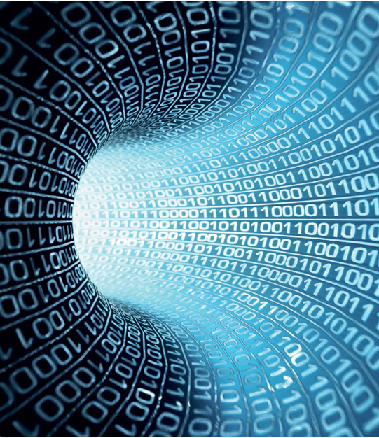

<!DOCTYPE html>
<html>
<head>
<title>Belajar Style Sheet Pada CSS</title>

</head>
<body>

### KELOMPOK 3 :
+ **Naily Arifah** (1910131320006)
+ **Jamaluddin**   (1910131210017)
#
#
#

# Sejarah Perkembangan Komputer Dari Tahun 1945-1956

__________________________________________________________________

Dengan terjadinya perang Dunia II, negara-negara yang terlibat dalam perang tersebut berusaha mengembangkan komputer untuk mengeksploitasi potensi strategis yang dimiliki komputer. Hal ini meningkatkan pendanaan pengembangan komputer serta mempercepat kemajuan teknik komputer Pada tahun 1945, Vannevar Bush - Menulis esai yang berjudul “As We May Think”, esai ini pertama kali diterbitkan dalam edisi Juli 1945 dari <em>Atlantik Bulanan.</em> Bush menulis bahwa hanya dengan menggunakan teknologi, orang dapat mengikuti sejumlah besar pengetahuan yang sedang diciptakan dunia.
 

Dengan akhir Perang Dunia II yang sudah di depan mata, Bush secara elegan memprediksi banyak teknologi saat ini, termasuk pengenalan suara, internet, <em> World Wide Web </em>, <em> ensiklopedia online </em>, <em>hypertext</em>, asisten digital pribadi, layar sentuh, dan desain antarmuka pengguna interaktif.
 

Tantangan utama yang ia fokuskan adalah bagaimana informasi harus diatur. Bush menemukan bahwa sistem numerik dan alfabet yang dominan tidak efektif. Sebaliknya, dia percaya bahwa pikiran manusia menyimpan dan memahami informasi melalui asosiasi, ketika pikiran kita berpindah dari satu ide ke ide  berikutnya, menciptakan konteks dan makna asli.
 

<figure class="center">
  
  <figcaption>Essai “As We May Think”</figcaption>
</figure>

Von Neumann mendesain Electronic Discrete Variable Automatic Computer (EDVAC) pada tahun 1945 dengan sebuah memori untuk menampung baik program ataupun data. Teknik ini memungkinkan komputer untuk berhenti pada suatu saat dan kemudian melanjutkan pekerjaannya kembali. Kunci utama arsitektur von Neumann adalah unit pemrosesan sentral (CPU), yang memungkinkan seluruh fungsi komputer untuk dikoordinasikan melalui satu sumber tunggal. Tahun 1951, UNIVAC I (Universal Automatic Computer I) yang dibuat oleh Remington Rand, menjadi komputer komersial pertama yang memanfaatkan model arsitektur Von Neumann tersebut.
 

<figure class="center">
  
  <figcaption>EDVAC</figcaption>
</figure>

Pada tahun 1946, di temukan Tracball oleh Ralph Benyamin(b. 1922) yang ia rancang pertama kali pertama saat mengerjakan proyek radar untuk Dinas Ilmiah Angkatan Laut Kerajaan pada tahun 1946. Trackball adalah salah satu perangkat input komputer pertama yang memungkinkan gerakan kursor bentuk bebas oleh pengguna, secara bersamaan di kedua x - dan y- pada layar komputer. Tetapi ada waktu yang lama antara penemuannya dan penggunaannya secara luas. Kemudian pada tahun yang sama di temukan juga Williams Tube (Tabung Williams) oleh Frederic Calland Williams (1911–1977). Tabung Williams (kadang-kadang dikenal sebagai Tabung William–Kilburn), adalah sistem memori elektronik pertama, menyediakan akses acak, artinya setiap lokasi memori dapat diakses dalam urutan apa pun.
 

<figure class="center">
  
  <figcaption>Trackball</figcaption>
</figure>

Pada tahun 1947, untuk pertama kali nya dilakukanya pencatatan bug oleh operator komputer, yang diantaranya William “Bill” Burke, namun demikian kata bug telah digunakan untuk menggambarkan kesalahan pada mesin sejak tahun 1875; ini terbukti dengan adanya kamus bahasa Inggris oxford, pada tahun 1889, Thomas Edison mengatakan kepada seorang jurnalis bahwa dia telah begadang dua malam berturut-turut untuk menemukan, dan memperbaiki, bug di fonografnya.
 

<figure class="center">
  
  <figcaption>BUG</figcaption>
</figure>

Tabung itu adalah tabung sinar katoda, seperti yang digunakan dalam tampilan radar Perang Dunia II, tetapi dimodifikasi sehingga titik-titik yang ditampilkan di layar dapat dibaca oleh komputer. Tabung Williams awal menyimpan data satu digit biner — 0 atau 1 — pada suatu waktu dalam susunan persegi panjang, biasanya 64 x 32.
Pada tahun 1947 juga di temukan Silicon Transistor (Transistor Silicon) oleh John Bardeen(1908–1991), Transistor adalah saklar elektronik: arus mengalir dari satu terminal ke terminal lain kecuali tegangan diterapkan ke terminal ketiga. Dikombinasikan dengan hukum aljabar Boolean, perangkat sederhana ini telah menjadi blok bangunan untuk mikroprosesor, sistem memori, dan seluruh revolusi komputer.
 

<figure class="center">
  
  <figcaption>Silicon Transistor</figcaption>
</figure>

Claude E. Shannon (1916–2001) memperkenalkan kata bit, digit biner, sebagai unit dasar informasi pada tahun 1948. Karya Shannon menjelaskan hubungan antara informasi dan entropi, sehingga membangun hubungan antara komputasi dan fisika. Memang, fisikawan terkenal Stephen Hawking membingkai banyak analisisnya tentang lubang hitam dalam hal kemampuan untuk menghancurkan informasi dan masalah yang diciptakan sebagai hasilnya. Pada tahun yang sama Curt Herzstark(1902–1988), menemukan Curta Calculator (Kalkulator Curta). Curta adalah kalkulator mekanik paling elegan ringkas, dan fungsional yang pernah diproduksi. Dirancang oleh insinyur Austria Curt Herzstark, ini adalah satu-satunya kalkulator saku mekanik digital yang pernah ditemukan. Digenggam dan ditenagai oleh engkol di bagian atas, Curta dapat menambah, mengurangi, mengalikan, dan membagi.
 

<figure class="center">
  
  <figcaption>Bit</figcaption>
</figure>

Pada tahun 1950 Richard Hamming (1915–1998), berhasil menemukan Error-Correcting Codes (ECC) yang merupakan jenis penyimpanan data komputer yang dapat mendeteksi dan memperbaiki jenis-jenis korupsi data internal yang paling umum. Memori ECC digunakan di sebagian besar komputer di mana korupsi data tidak dapat ditoleransi dalam keadaan apa pun, seperti untuk komputasi ilmiah atau keuangan.
 

<figure class="center">
  
  <figcaption>ECC</figcaption>
</figure>

Fritz Pfleumer (1881–1945) pada tahun 1951 menemukan Pita Magnetik untuk digunakan Komputer, Pita magnetik (Magnetic Tape) adalah media yang terbuat dari campuran plastik dan ferric oxide untuk merekam atau menyimpan informasi. Data disimpan dalam pita magnetik dalam bentuk titik bermagnit, titik tersebut ditunjukan dengan tanda panah, panah yang mengarah ke atas ada magnitnya (1), tanda panah yang mengarah kebawah tidak ada magnitnya (0). Kolom vertikal terdiri dari 9 bits dimana 8 bits untuk menyimpan karakter dan 1 bits untuk parity check.
 

<figure class="center">
  
  <figcaption>Pita Mangnetic</figcaption>
</figure>

Pada tahun 1952 di temukan Speech Recognition Computer. Sistem pengenalan angka otomatis, juga dikenal sebagai Audrey, dikembangkan oleh Bell Labs pada tahun 1952. Audrey adalah tonggak sejarah dalam upaya untuk memungkinkan komputer mengenali dan merespons ucapan manusia. Audrey dirancang untuk mengenali angka yang diucapkan 0 hingga 9 dan memberikan umpan balik dengan serangkaian lampu berkedip yang terkait dengan angka tertentu.
Pada tahun 1947, penemuan transistor sangat memengaruhi perkembangan komputer. Transistor menggantikan tube vakum di televisi, radio, dan komputer. Akibatnya, ukuran mesin-mesin elektrik berkurang drastis. Transistor mulai digunakan di dalam komputer mulai pada tahun 1956. Penemuan lain yang berupa pengembangan memori inti-magnetik membantu pengembangan komputer generasi kedua yang lebih kecil, lebih cepat, lebih dapat diandalkan, dan lebih hemat energi dibanding para pendahulunya. Mesin pertama yang memanfaatkan teknologi baru ini adalah super komputer.
 

<figure class="center">
  
  <figcaption>Speech Recognition Computer</figcaption>
</figure>

Pada akhir 1955, Newell dan Simon mengembangkan The Logic Theorist, program AI pertama. Program ini merepresentasikan masalah sebagai model pohon, lalu penyelesaiannya dengan memilih cabang yang akan menghasilkan kesimpulan terbenar. Program ini berdampak besar dan menjadi batu loncatan penting dalam mengembangkan bidang AI. Pada tahun 1956 John McCarthy dari Massacuhetts Institute of Technology dianggap sebagai bapak AI, menyelenggarakan konferensi untuk menarik para ahli komputer bertemu, dengan nama kegiatan “The Dartmouth summer research project on artificial intelligence.”
 

<figure class="center">
  
  <figcaption>AI</figcaption>
</figure>

Pada bulan Juli tahun 1956 istilah byte diciptakan oleh Werner Buchholz , selama fase awal desain untuk Komputer IBM Stretch. Ini adalah pengeja ulang byte untuk menghindari kesalahan mutasi ke bit. Perbedaan Bit dan Byte Bit adalah kependekan dari "Binary Digit", yang berarti digit biner. Binary digit adalah unit satuan terkecil dalam komputasi digital. Komputer tidak menggunakan angka desimal untuk menyimpan data. Semua data komputer disimpan dalam angka-angka biner. Hanya 2 nilai berbeda yang bisa dinyatakan satu bit, entah nilai 0 atau nilai 1. Dalam telekomunikasi digital juga demikian, semua level tegangan diubah menjadi bentuk data biner. Istilah "binary digit" atau "bit" diperkenalkan oleh John Tukey di tahun 1947, saat itu ia bekerja sebagai seorang ilmuwan diBell Laboratories. Sejak saat itu istilah 'bit' terus digunakan di dunia komputer. Satu byte adalah 8 satuan bit yang digabung menjadi satu. Jadi byte adalah satuan informasi yang lebih besar dari bit.
 

<figure class="center">
  
  <figcaption>Byte</figcaption>
</figure>

Demikian lah sejarah singkat perkembangan komputer dari tahun 1945-1956, Saat ini perkembangan teknologi masih terus terjadi. Setiap perubahannya akan membawa kemudahan bagi pengguna, untuk menyelesaikan kegiatannya.

</body>
</html>